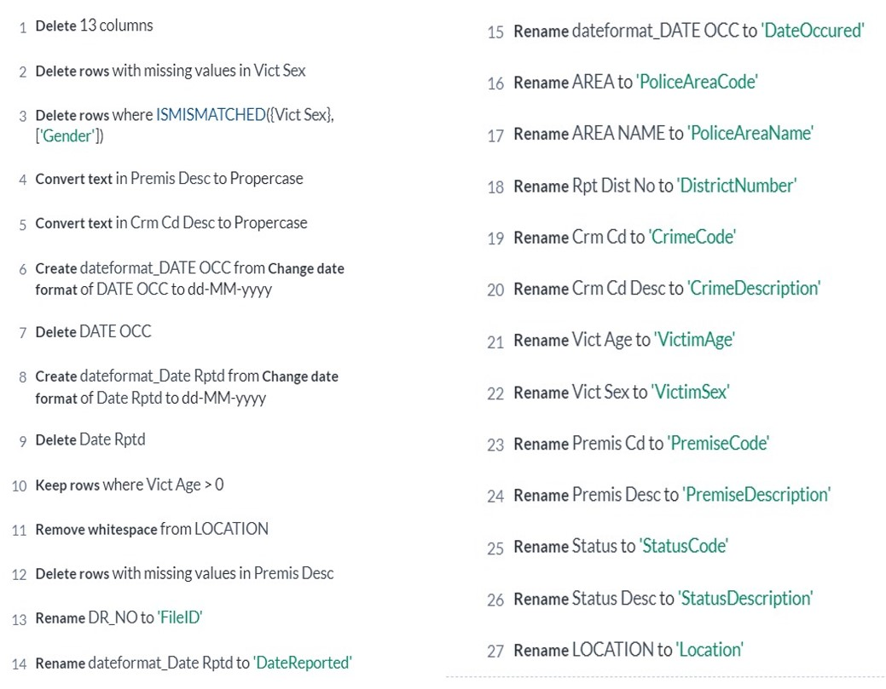
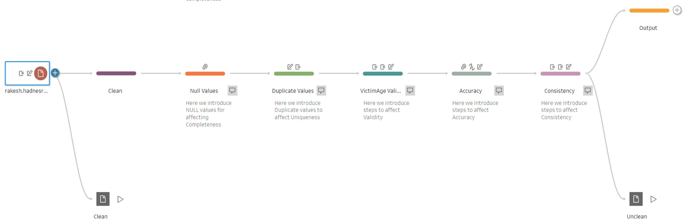

# Crime Data Chronicles

A comprehensive data management project demonstrating the complete data lifecycle including data cleaning, uncleaning (intentional corruption for educational purposes), and restoration using Tableau Prep Builder. This project showcases data quality management skills and ETL (Extract, Transform, Load) processes applied to crime data analysis.

## Project Overview

Crime Data Chronicles is an academic data management project that explores data quality challenges by intentionally introducing data quality issues into cleaned datasets and then demonstrating systematic approaches to restore data integrity. This reverse-engineering approach provides valuable insights into data cleaning best practices and common data quality problems.

## Key Features

- **Complete Data Pipeline**: From original raw data to cleaned data to intentionally corrupted data
- **Data Quality Management**: Systematic approach to identifying and fixing data quality issues
- **Visual Documentation**: Step-by-step process documentation with screenshots
- **Tableau Prep Workflows**: Professional ETL workflows for data transformation
- **Comprehensive Reporting**: Detailed documentation of methodologies and processes

## Project Structure

```
Crime-Data-Chronicles/
├── Original_to_Clean_Data.xlsx           # Original dataset and cleaned version
├── Clean_to_Unclean_Data.xlsx            # Cleaned data with intentional quality issues
├── Data_Uncleaning.tflx                  # Tableau Prep workflow for data uncleaning
├── Cleaning_Recipe.jpg                   # Visual guide for data cleaning steps
├── Uncleaning_Recipe.jpg                 # Visual guide for data uncleaning steps
├── Data_Management-PPT.pptx              # Project presentation
├── Official Report_ Data Management Project.docx  # Comprehensive project report
└── Unique Values/                        # Screenshots of unique values analysis
    ├── 1.png to 28.png                   # Field-by-field value distribution
```

## Data Transformation Stages

### Stage 1: Data Cleaning (Original to Clean)

The initial phase involves cleaning raw crime data by:
- Removing duplicates and inconsistencies
- Standardizing data formats
- Handling missing values
- Validating data integrity
- Normalizing categorical variables

**Output**: `Original_to_Clean_Data.xlsx`

### Stage 2: Data Uncleaning (Clean to Unclean)

Educational exercise introducing controlled data quality issues:
- Introducing missing values
- Creating format inconsistencies
- Adding duplicate records
- Corrupting data types
- Generating anomalies

**Output**: `Clean_to_Unclean_Data.xlsx`

**Workflow**: `Data_Uncleaning.tflx` (Tableau Prep Builder)

### Stage 3: Data Re-cleaning (Unclean to Clean)

Demonstrating data restoration techniques and best practices.

## Tools and Technologies

- **Tableau Prep Builder**: ETL workflow design and execution
- **Microsoft Excel**: Data storage and initial analysis
- **Microsoft PowerPoint**: Project presentation
- **Microsoft Word**: Documentation and reporting
- **Data Profiling**: Unique value analysis and data distribution

## Dataset Information

The project uses crime data with the following characteristics:
- **28 Fields**: Comprehensive crime incident attributes (see Unique Values folder)
- **Multiple Data Types**: Categorical, numerical, date/time, and text fields
- **Large Dataset**: Sufficient size for meaningful analysis
- **Real-world Complexity**: Authentic data quality challenges

## Unique Values Analysis

The `Unique Values/` folder contains 28 screenshots (1.png to 28.png) showing:
- Distribution of unique values for each field
- Data cardinality analysis
- Pattern identification
- Anomaly detection

These visualizations provide insights into:
- Field diversity
- Data completeness
- Categorical distributions
- Potential data quality issues

## Data Cleaning Recipe



The cleaning recipe documents the systematic approach to:
1. Data validation
2. Missing value treatment
3. Format standardization
4. Duplicate removal
5. Outlier handling
6. Data type correction

## Data Uncleaning Recipe



The uncleaning recipe demonstrates controlled introduction of:
1. Missing value patterns
2. Format inconsistencies
3. Duplicate records
4. Data type mismatches
5. Invalid entries

## Key Learning Objectives

This project demonstrates proficiency in:
- **Data Quality Management**: Identifying and resolving data quality issues
- **ETL Processes**: Designing and implementing data transformation workflows
- **Tableau Prep**: Advanced data preparation techniques
- **Data Profiling**: Analyzing data distributions and patterns
- **Documentation**: Creating comprehensive technical documentation
- **Problem-Solving**: Systematic approach to data challenges

## Documentation

### Presentation
**File**: `Data_Management-PPT.pptx`
- Project overview and objectives
- Methodology and approach
- Key findings and insights
- Visual demonstrations
- Conclusions and recommendations

### Official Report
**File**: `Official Report_ Data Management Project.docx`
- Detailed methodology
- Step-by-step procedures
- Data transformation logic
- Quality assessment metrics
- Lessons learned
- Best practices

## How to Use This Project

### Prerequisites
- Tableau Prep Builder (for .tflx workflow files)
- Microsoft Excel (for .xlsx data files)
- Microsoft PowerPoint (for presentation)
- Microsoft Word (for report)

### Exploring the Data

1. **Review Original Data**
   - Open `Original_to_Clean_Data.xlsx`
   - Compare raw data with cleaned version

2. **Examine Data Quality Issues**
   - Open `Clean_to_Unclean_Data.xlsx`
   - Identify intentional data quality problems

3. **Understand the Workflow**
   - Open `Data_Uncleaning.tflx` in Tableau Prep Builder
   - Follow the transformation steps

4. **Analyze Field Distributions**
   - Browse through `Unique Values/` folder
   - Review each field's value distribution

5. **Study Documentation**
   - Review the presentation for overview
   - Read the official report for detailed methodology

## Methodology

### Data Cleaning Approach
1. **Initial Assessment**: Profile data to identify quality issues
2. **Define Rules**: Establish data quality rules and standards
3. **Apply Transformations**: Use Tableau Prep for systematic cleaning
4. **Validate Results**: Verify data quality improvements
5. **Document Process**: Record all transformation steps

### Data Uncleaning Approach
1. **Identify Target Issues**: Select specific data quality problems to introduce
2. **Design Corruption Logic**: Create controlled data quality degradation
3. **Implement Changes**: Apply transformations using Tableau Prep
4. **Verify Corruption**: Ensure intended issues are present
5. **Document Patterns**: Record what issues were introduced and why

## Use Cases

This project is valuable for:
- **Data Quality Training**: Teaching data cleaning best practices
- **Portfolio Development**: Demonstrating data management skills
- **Process Documentation**: Creating data governance procedures
- **Tool Evaluation**: Assessing Tableau Prep capabilities
- **Educational Purposes**: Learning data quality concepts

## Skills Demonstrated

- Data profiling and exploration
- ETL workflow design
- Data quality assessment
- Tableau Prep Builder expertise
- Excel data manipulation
- Technical documentation
- Data governance principles
- Problem-solving and analytical thinking

## Project Insights

### Key Findings
- Systematic approaches to data quality are essential
- Visual workflows enhance transparency and reproducibility
- Documentation is critical for knowledge transfer
- Controlled data corruption helps understand quality issues
- Multiple perspectives on data improve understanding

### Best Practices
- Always profile data before cleaning
- Document transformation logic
- Use visual ETL tools for complex workflows
- Validate results at each stage
- Maintain original data separately

## Future Enhancements

- [ ] Automate data quality scoring
- [ ] Implement SQL-based cleaning scripts
- [ ] Add Python data validation
- [ ] Create interactive dashboards
- [ ] Develop data quality metrics
- [ ] Build automated testing framework
- [ ] Add version control for data
- [ ] Implement data lineage tracking

## Academic Context

This project was completed as part of a Data Management course, demonstrating:
- Understanding of data quality dimensions
- Practical application of ETL concepts
- Ability to work with enterprise tools
- Technical documentation skills
- Critical thinking about data processes

## File Sizes

- `Original_to_Clean_Data.xlsx`: 38 MB
- `Clean_to_Unclean_Data.xlsx`: 40 MB
- `Data_Uncleaning.tflx`: 35 MB
- `Data_Management-PPT.pptx`: 5.9 MB
- `Official Report_ Data Management Project.docx`: 3.9 MB

## Contact

For questions or discussions about this project, please open an issue on the [GitHub repository](https://github.com/ashwith1/Crime-Data-Chronicles).

## Acknowledgments

- Data Management course instructors
- Tableau community for Prep Builder resources
- Open data providers for crime datasets

## License

This project is created for educational purposes. Please ensure proper attribution when using any materials from this repository.

---

**Note**: This project demonstrates data management concepts through practical application. The intentional data corruption (uncleaning) is performed solely for educational purposes to better understand data quality challenges and solutions.
